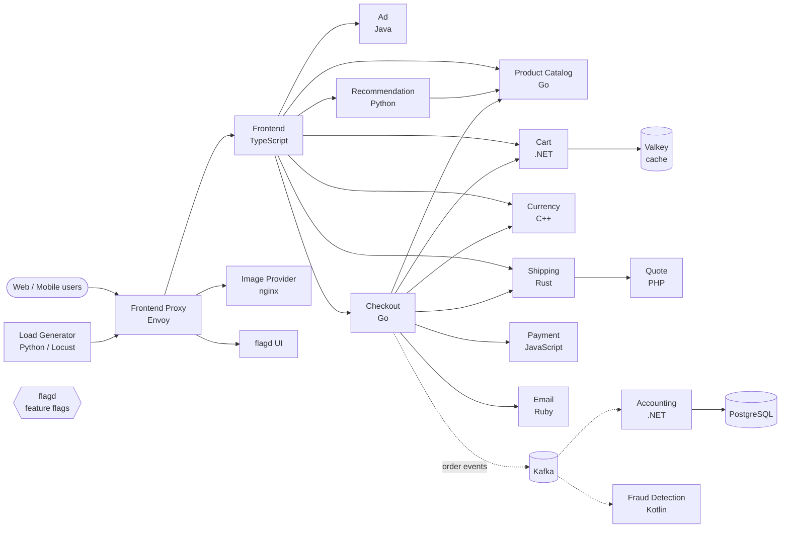

# Astronomy E-commerce Shop: Microservices on AWS EKS

End-to-end DevOps implementation for a polyglot microservices e-commerce app
(the OpenTelemetry Astronomy Shop), from local containers to a GitOps-managed
Kubernetes deployment on AWS.

> 🚧 In progress. Sections are checked off as they are completed.

## Architecture

Service architecture of the OpenTelemetry demo **v2.1.3**, taken from this repo's
`docker-compose.yml`. Solid arrows are synchronous calls (gRPC/HTTP); dotted arrows
are asynchronous events through Kafka.

- **flagd** (feature flags) is read by ad, cart, checkout, email, fraud-detection,
  frontend, load-generator, payment, product-catalog and recommendation. Those links are
  left off the diagram to keep it readable.
- **Observability:** every service sends traces, metrics and logs to the OpenTelemetry
  Collector, which forwards them to Jaeger (traces), Prometheus and Grafana (metrics) and
  OpenSearch (logs).
- The upstream [architecture diagram](https://opentelemetry.io/docs/demo/architecture/)
  shows the latest release, which adds AI services (chatbot, agent, MCP) that aren't in v2.1.3.

## Tech stack

| Area | Tools |
|---|---|
| Cloud | AWS (EC2, VPC, EKS, IAM, S3, DynamoDB) |
| Containers | Docker, Docker Compose |
| Infrastructure as Code | Terraform |
| Orchestration | Kubernetes (EKS) |
| CI | GitHub Actions |
| CD / GitOps | Argo CD |

## Progress

- [ ] Environment setup (EC2, Docker, kubectl, Terraform, AWS CLI)
- [ ] Run the app locally with Docker Compose
- [ ] Containerize services (Go, Java, Python)
- [ ] Provision VPC + EKS with Terraform (remote state in S3, locking with DynamoDB)
- [ ] Kubernetes manifests + deployment to EKS
- [ ] Ingress + custom domain
- [ ] CI with GitHub Actions
- [ ] CD with Argo CD (GitOps)

## Repo layout

| Path | Contents |
|---|---|
| `src/` | Microservice source code and Dockerfiles |
| `docker-compose.yml` | Local multi-container setup |
| `terraform/` | AWS infrastructure (coming soon) |
| `kubernetes/` | K8s manifests (coming soon) |
| `.github/workflows/` | CI pipelines (coming soon) |

## Credits

- Application: [OpenTelemetry Demo](https://github.com/open-telemetry/opentelemetry-demo) v2.1.3
  (Apache 2.0; see `LICENSE` and `README.opentelemetry.md`).
- Project structure follows Abhishek Veeramalla's *Ultimate DevOps Project* course;
  the DevOps implementation in this repo is my own work.
- Used Claude (Anthropic) as a learning and debugging assistant.
