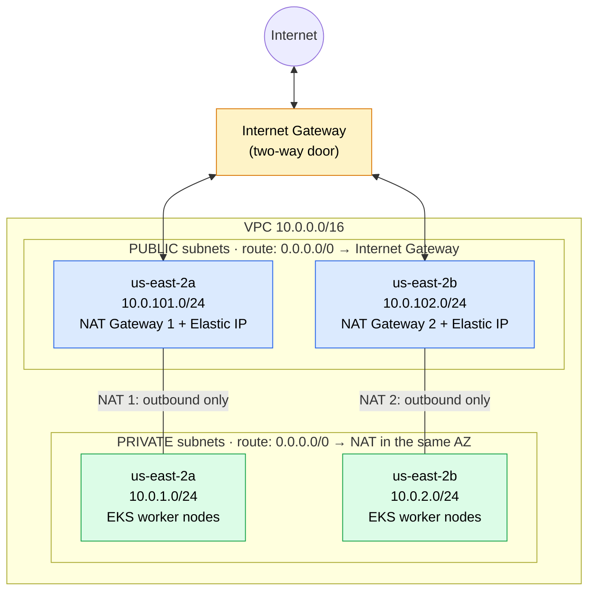

# VPC module

The network that the EKS cluster runs in: one VPC spread across **2 Availability Zones (AZs)**,
each with one **public** and one **private** subnet. (The module creates one of each per AZ passed in,
so 3 AZs would also work.)

## Diagram

Values set by the root module: VPC `10.0.0.0/16` in `us-east-2`, AZs `us-east-2a` and `us-east-2b`.

- **Top layer, public (blue):** sends and receives internet traffic through the Internet Gateway. Holds the NAT gateways (and, later, load balancers).
- **Bottom layer, private (green):** the worker nodes. They reach the internet only by going **out** through the
  NAT gateway in their own AZ (replies come back on the same connection). Nothing on the internet can start a
  connection to them.

## Parts → Terraform resources

| # | Part | Job | Resource in `main.tf` |
|---|---|---|---|
| ① | VPC | The private network and its address range (CIDR) | `aws_vpc.main` |
| ② | Private subnets (1 per AZ → 2) | Worker nodes; not reachable from the internet | `aws_subnet.private` |
| ② | Public subnets (1 per AZ → 2) | NAT gateways and internet-facing load balancers | `aws_subnet.public` |
| ③ | Internet Gateway | Two-way door between the VPC and the internet | `aws_internet_gateway.main` |
| ④ | Elastic IPs | Fixed public IP for each NAT gateway | `aws_eip.nat` |
| ④ | NAT Gateways (1 per AZ → 2) | One-way door: private subnets reach **out** only | `aws_nat_gateway.main` |
| ⑤ | Public route table | `0.0.0.0/0 → Internet Gateway` | `aws_route_table.public` |
| ⑤ | Private route tables (1 per AZ → 2) | `0.0.0.0/0 → that AZ's NAT gateway` | `aws_route_table.private` |
| ⑤ | Associations | Attach each subnet to its route table | `aws_route_table_association.*` |

## Inputs and outputs

| Inputs (`variables.tf`) | Outputs (`outputs.tf`) |
|---|---|
| `vpc_cidr`, `availability_zones`, `private_subnet_cidrs`, `public_subnet_cidrs`, `cluster_name` | `vpc_id`, `private_subnet_ids`, `public_subnet_ids` |

## Design notes

- **2 AZs**: the minimum EKS accepts, still highly available, cheaper than the course's 3.
- **One NAT gateway per AZ** (high availability): if one AZ fails, the other keeps outbound access.
  ~$0.045/hr each, so ~$2.15/day for 2.
- **Tags** `kubernetes.io/role/elb` (public) and `kubernetes.io/role/internal-elb` (private) tell
  Kubernetes where to put internet-facing and internal load balancers.
- **DNS support + DNS hostnames** are both enabled; EKS requires them.
