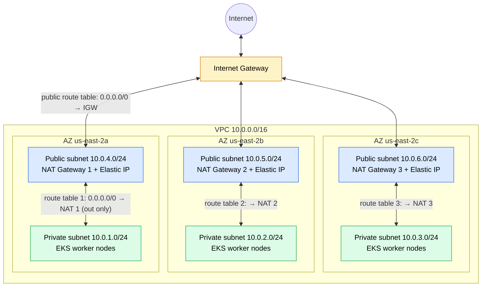

# VPC module

The network that the EKS cluster runs in: one VPC spread across 3 Availability Zones (AZs),
each with a **public** and a **private** subnet.

## Diagram

Example values (set by the root module): VPC `10.0.0.0/16` in `us-east-2`.

- **Two-way arrows (public):** public subnets send and receive internet traffic through the Internet Gateway.
- **Private ↔ public (through NAT):** private subnets reach the internet only by going **out** through their own
  AZ's NAT gateway (replies come back on the same connection). Nothing on the internet can start a connection
  to the worker nodes.

## Parts → Terraform resources

| # | Part | Job | Resource in `main.tf` |
|---|---|---|---|
| ① | VPC | The private network and its address range (CIDR) | `aws_vpc.main` |
| ② | Private subnets (1 per AZ) | Worker nodes; not reachable from the internet | `aws_subnet.private` |
| ② | Public subnets (1 per AZ) | NAT gateways and internet-facing load balancers | `aws_subnet.public` |
| ③ | Internet Gateway | Two-way door between the VPC and the internet | `aws_internet_gateway.main` |
| ④ | Elastic IPs | Fixed public IP for each NAT gateway | `aws_eip.nat` |
| ④ | NAT Gateways (1 per AZ) | One-way door: private subnets reach **out** only | `aws_nat_gateway.main` |
| ⑤ | Public route table | `0.0.0.0/0 → Internet Gateway` | `aws_route_table.public` |
| ⑤ | Private route tables (1 per AZ) | `0.0.0.0/0 → that AZ's NAT gateway` | `aws_route_table.private` |
| ⑤ | Associations | Attach each subnet to its route table | `aws_route_table_association.*` |

## Inputs and outputs

| Inputs (`variables.tf`) | Outputs (`outputs.tf`) |
|---|---|
| `vpc_cidr`, `availability_zones`, `private_subnet_cidrs`, `public_subnet_cidrs`, `cluster_name` | `vpc_id`, `private_subnet_ids`, `public_subnet_ids` |

## Design notes

- **One NAT gateway per AZ** (high availability): if one AZ fails, the others keep outbound access.
  Costs about 3× a single shared NAT gateway (~$0.045/hr each).
- **Tags** `kubernetes.io/role/elb` (public) and `kubernetes.io/role/internal-elb` (private) tell
  Kubernetes where to put internet-facing and internal load balancers.
- **DNS support + DNS hostnames** are both enabled; EKS requires them.
